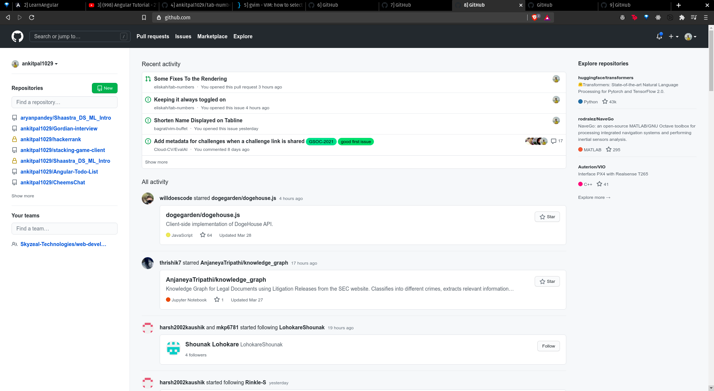
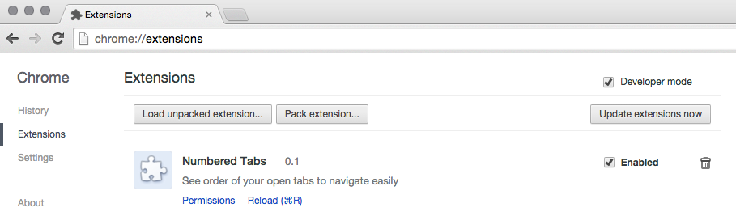

# Browser Extension tab-numbers

If you are used to **switch between open tabs in Google Chrome** using CMD/CTRL/ALT+number of tab (eg. `CMD+4` for tab number 4), you might be tired of visually counting the tabs you want to switch to.

With this extension active, this is what you get:

Use `ALT+T`/`Option+T` to toggle this extension on/off.

## Support

* Google Chrome
* Mozilla Firefox

## Installation

Clone the repository:

    $ git clone https://github.com/eliskah/tab-numbers.git

Then set up the manifest for your browser:

**Chrome:**

    $ cp manifest.chrome.json manifest.json

**Firefox:**

    $ cp manifest.firefox.json manifest.json

**Chrome:** go to `chrome://extensions`, enable **Developer mode**, click `Load unpacked` and select the extension folder.

**Firefox:** go to `about:debugging`, click **This Firefox**, then **Load Temporary Add-on** and select the `manifest.json` file.

## Usage

Once the extension is installed, titles of open tabs will be prepended with the tab index so you can just jump to the tab of choice.

Please note:

* Some tabs (new tab, extension page, Chrome Webstore page, when you are displaying files etc.) don't have titles altered (at least for now).

If you want to use different keyboard shortcut, navigate to `chrome://extensions/configureCommands` and set it as you like.
